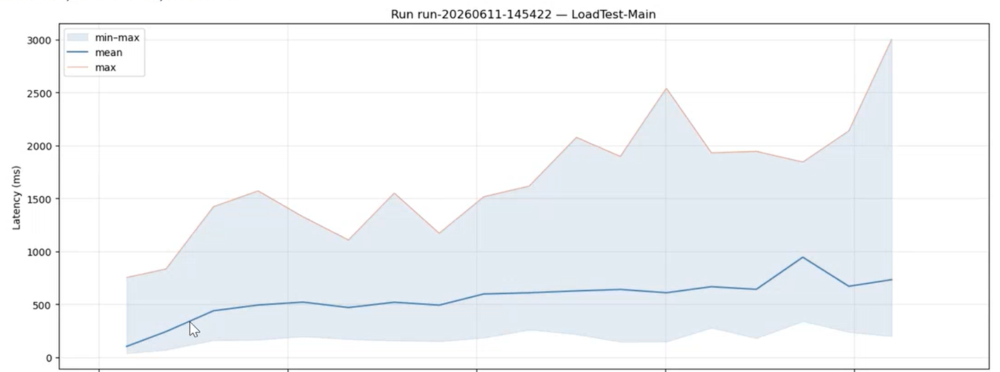
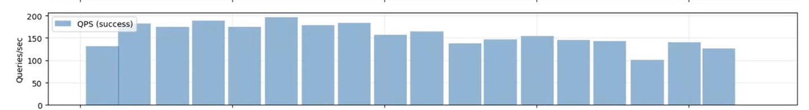
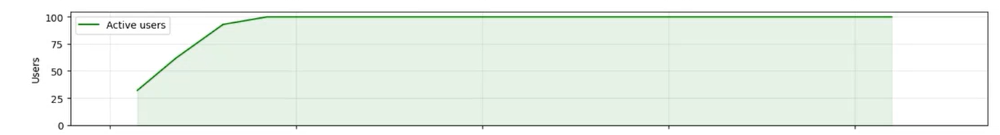
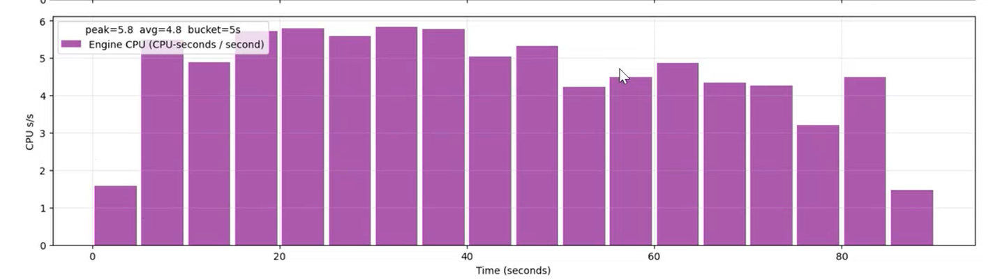
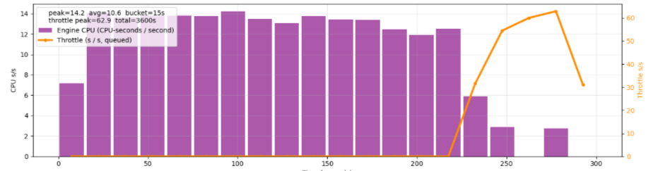

# Load testing Power BI semantic models — an overview

This document explains **what** the tool does, **why** you'd use it, and **how
to read the results**. It deliberately avoids implementation detail — for
parameter reference see [`loadgen-main.md`](loadgen-main.md), for the CLI see
[`loadgen-cli.md`](loadgen-cli.md), and for the README see
[`../README.md`](../README.md).

If you're new to the tool, read this first; it's the missing piece between "I
ran the notebook" and "what does this graph mean for my capacity."

---

## What is a load test (in this tool)?

A **load test** simulates a fixed number of human users hitting a Power BI
semantic model concurrently for a fixed duration, executing a fixed set of
DAX queries that came from a real Power BI report.

Three nouns to keep straight:

| Term | What it is |
|---|---|
| **Load Test** | The named reusable test configuration. One notebook = one Load Test. |
| **Run** | One execution of a Load Test. Every Run All mints a fresh `RunId` and is preserved alongside prior Runs. |
| **Scenario** | The DAX workload — the specific queries and (optionally) impersonated users — captured from a Power BI Performance Analyzer JSON file. |

The Scenario is the **most important input**. The tool can't make
representative numbers from queries that don't represent your users — so
load testing always starts with capturing a Scenario from a real session
against a real report.

---

## Methodology

The end-to-end flow is **capture → run → analyze → translate**.

### 1. Capture

Open the report you want to load-test in either the **Fabric portal** or
**Power BI Desktop**. Open *Performance Analyzer* → *Start recording* →
interact with the report exactly as a real user would (apply slicers, switch
pages, change filters, refresh visuals) → *Stop* → *Export*. You get a
`.json` file describing every DAX query the report fired, paired with the
visual that fired it.

A Scenario should mirror **one user's session** — the tool will replay it in
parallel across many simulated users.

> **Watch out for Power BI's visual cache.** If you click *Refresh* on the
> page Power BI may serve some visuals from the client cache and they will
> *not* fire DAX queries. The notebook will warn you when it sees Visual
> Container Lifecycle events without a paired Execute DAX Query — to avoid
> this, restart Desktop / Ctrl+F5 in the service before recording, then
> refresh **individual visuals** (right-click → Refresh visual) rather than
> the whole page.

### 2. Run

Drop the `.json` onto the notebook's *Resources* panel, set the load shape
in cell 1, **Run All**. The defaults are:

- **25 concurrent users** for **60 seconds**, with a **15-second linear ramp**.
- **10-second think-time** between iterations (one user finishing all the
  queries in the Scenario, then pausing before the next loop).

These are intentionally short so first-time tests give immediate feedback.
For real measurements, see *How long should the test run?* below.

### 3. Analyze

Cell 4 plots four charts (latency, throughput, active users, engine CPU)
straight from the per-run telemetry. If you opted into a lakehouse, the
same data lands in six Delta tables for cross-Run dashboards. See
*Reading the charts* below.

### 4. Translate to capacity impact

Engine CPU consumption (visible in the bottom chart) drives the capacity
units (CUs) that show up in the Capacity Metrics App. To find the actual
capacity cost of the workload you just simulated, see *Translating engine
CPU into capacity impact* below.

---

## Choosing a load shape

The defaults are a starting point, not a recommendation. Tune to match
the population you're modeling.

### Concurrent users

Set this to the **number of real human users actively interacting with the
report at the same time**, not the number of users who *have access* to it.
A 5,000-seat report with bursty usage might have 50 concurrent users at
peak; a small executive dashboard might have 5.

You typically know this from one of:
- Capacity Metrics → background operations during a peak hour
- Front-end logs / SSO data
- "It's a Monday-morning report and we have ~200 people on at 9am" rule of thumb

When in doubt, sweep — run the test at 25, 50, 100, 200 concurrent users
and look at where latency starts to degrade.

### Ramp time

A linear ramp from 0 → `CONCURRENT_USERS`. The ramp exists so the system
isn't slammed simultaneously by all users on the very first second — which
isn't realistic and contaminates the early seconds of the steady state.

A good rule: **ramp time ≈ 25–50% of test duration**, with a floor of
~10 seconds so engine cold-start doesn't dominate the ramp.

### Pause between iterations (think time)

This is the dwell time between a user finishing one pass through the
Scenario and starting the next. **The default is 10 seconds**, which
roughly approximates a human looking at a refreshed page, reading it,
clicking a slicer, looking again, and clicking the next thing.

Lower values (1–2 s) effectively turn the test into a stress test —
useful to find the throughput ceiling but not representative of human
load. Higher values (30 s+) model heavier think time (e.g., users
toggling between the report and another app).

### Duration

After the ramp completes, the test runs at steady state for
`DURATION_SECONDS`. The system typically reaches steady state within a few
seconds; running for longer gives you more data points but doesn't change
the conclusion. **One to ten minutes is the useful range**; tests longer
than ~15 minutes rarely add information and just complicate the post-run
analysis.

> **Hard ceiling at ~60 minutes today.** The notebook acquires a Power
> BI access token at the start of cell 3 and hands it to LoadGen, which
> uses it for every new ADOMD connection. Tokens are valid for ~60–75
> minutes, so any virtual user that needs to reconnect after that
> window will fail. Already-open connections keep working — the engine
> validates the token at connect time only — so a run that opens all
> its users during the ramp and never drops a connection can sometimes
> finish past the token's expiry. Periodic in-flight token refresh is
> on the roadmap but not yet implemented; for now, **keep runs under
> 60 minutes** (one minute to ten minutes is the useful range anyway —
> see *Duration* above).

---

## Reading the charts

Cell 4 produces a stacked figure with four panels sharing one time axis.
All four panels read off the same per-Run CSV — they are *exactly* what
the simulated users experienced.

### Panel 1 — Query duration (latency)

A blue band showing **min / max** query duration per time bucket, a
**mean** line, and a **max** line. Y-axis is milliseconds.

What to look for:
- During ramp: latency typically rises as more users queue against the
  engine. After the ramp, it should flatten into a steady state.
- A widening band (max far above mean) means **tail latency** —
  users-of-the-hour are still getting the responses they want, but a
  fraction are waiting much longer. This is usually queueing or memory
  pressure.
- Latency that keeps rising past the ramp is a saturation signal — the
  engine can't keep up with the offered load and the queue is growing
  without bound. The throughput panel will show a flat ceiling at the
  same time.

P50 / P95 / P99 percentiles for the run are also written to the
`LoadTestRuns` Delta table; the chart shows the temporal shape, the
percentiles summarize the distribution.

### Panel 2 — Throughput (queries/sec)

A bar chart of queries-per-second, bucketed across the run. If any
queries errored, error QPS is stacked in red on top of the success bars.

What to look for:
- Should ramp linearly with active users until the engine saturates,
  then flatline.
- The **peak** sustained QPS is your throughput number — write this
  down per scenario.
- Errors during steady state (red bars) usually indicate capacity
  throttling, connection-pool exhaustion, or model-side errors.

### Panel 3 — Active users

A green area chart of active virtual users over time. This is mostly a
sanity-check panel — confirms the ramp ran as configured and that users
didn't drop out mid-test.

What to look for:
- Should be a clean ramp from 0 → `CONCURRENT_USERS` over
  `USER_RAMP_TIME_SEC`, then flat.
- A drop-off mid-test means user threads exited unexpectedly (usually a
  fatal connection error). Cross-check with the error QPS bars in Panel 2.

### Panel 4 — Engine CPU

The most important panel for capacity planning. Purple bars showing
**CPU-seconds per second of wall-clock**, sourced from the engine trace's
`ExecutionMetrics` events. The legend reports peak and average.

The unit (CPU-seconds / second) is the **effective number of CPU cores
the AS engine kept busy** for the workload — i.e. if the test drove
"3 CPUs", the engine was using on average 3 cores' worth of CPU time
during the run.

What to look for:
- After the ramp, CPU should plateau at a level that reflects the
  steady-state load.
- A plateau much lower than your capacity's CPU budget means there's
  headroom; users could go higher.
- A plateau that is suspiciously flat *with* growing latency means the
  engine is throttled or memory-bound — CPU is no longer the bottleneck.
- If throttling occurred, an **orange line** appears on a secondary axis
  showing throttle-seconds-per-second (queued time). Any orange means
  some queries waited behind the capacity's smoothing window.

The throttled run above shows the classic signature: CPU plateaus at
~13 CPUs for the first ~225 seconds, then the orange throttle line
shoots up to 60+ queued-seconds-per-second while the CPU bars collapse
to ~3 — the engine isn't doing less work because the model got faster,
it's doing less because the capacity is making queries wait. Latency
in panel 1 for the same run will balloon at that point. The legend
reports total queued seconds (`total=3600s` here) so you can see the
aggregate user-perceived delay.

> The engine CPU shown here is the same metric that drives capacity
> utilization in Power BI / Fabric — but the **conversion** from CPU
> consumption to capacity units (CUs), and the smoothing window applied
> to bursts, are not modeled here. Use the **Capacity Metrics App** for
> the actual CU figure (next section).

---

## Translating engine CPU into capacity impact

The bottom panel tells you *what your model did* during the test. The
**Capacity Metrics App** tells you *what that cost in CU-seconds against
your capacity*.

### Workflow

1. Pick a capacity that's **otherwise idle** during the test — no
   refreshes scheduled, no other reports being viewed. A test capacity
   or off-hours run works well. The cleaner the baseline, the easier
   the next step.
2. Note the wall-clock window of your Run (`StartTimeUtc` /
   `EndTimeUtc` from `LoadTestRuns`, or the panel x-axis in cell 4).
3. Wait **15–30 minutes** for the Capacity Metrics App to ingest the
   run.
4. Open the Capacity Metrics App, drill into the capacity hosting the
   semantic model, and filter the timeline to your Run's window.
5. Read the CU consumption attributed to interactive operations against
   your model during that window. That is the capacity cost of *this
   exact Scenario at this exact concurrency*.

### Extrapolating to production

The whole point of load testing is to predict production behavior, so:

- A Run that drove **N concurrent users** consuming **X CU-seconds** in
  **D seconds** of wall-clock means each *concurrent* user was costing
  roughly `X / (N × D)` CU-seconds-per-second on average. Keep this
  number per scenario.
- Multiply by the number of *concurrent* users you expect in production
  to estimate the floor of CU consumption that scenario will drive.
  This is a floor because real users vary their think time, scroll
  through pages you didn't capture, and hit refresh on visuals you
  didn't include.
- Compare with your capacity's CU budget for the same time window.
  Capacity Metrics will tell you how close you are to throttling
  thresholds.

### Sweep, don't extrapolate too far

Linear extrapolation works only inside the regime where the engine
isn't saturated. If your 100-user run drove 5 CPUs and your 200-user
run drove 9, the relationship is roughly linear and you can extrapolate
to 300. If your 100-user run drove 5 and your 200-user run drove 6
*with sharply rising latency*, the engine is queueing — you're seeing
saturation, not capacity, and adding users will hurt the user
experience without burning much more CPU. **Always run two or three
concurrency levels** before quoting a capacity-cost number.

---

## What "good" looks like

A healthy load test (engine has headroom, capacity has headroom):

- Latency band ramps up during the warm-up, plateaus during steady state,
  and the P99 line stays close to the mean.
- Throughput climbs linearly with active users and plateaus at a
  level that is *predicted* by single-user latency × concurrent users.
- Engine CPU plateaus well below the capacity's CPU budget; no orange
  throttle line.
- Capacity Metrics App, 30 minutes later, shows < 50% of CU budget for
  the test window.

A load test of a **saturated** engine looks like:

- Latency keeps rising past the ramp; max line diverges from mean.
- Throughput plateaus (or worse, dips) while users are still ramping.
- Errors appear in the QPS panel.
- CPU plateaus or starts dipping while users are still ramping —
  characteristic of queue-bound rather than CPU-bound saturation.
- Capacity Metrics shows throttle events.

If you see the second pattern *before* you reach the production
concurrent-user count, the model needs tuning (DAX, relationships,
calculated columns, partition design, Direct Lake fallback) before it
can carry production load.

---

## Common patterns

- **Baseline vs. what-if.** Run the same Scenario against the current
  model, then again against a tuned copy. Both Runs land in
  `LoadTestRuns` with different `RunId`s; compare side by side.
- **Concurrency sweep.** Run at 25 / 50 / 100 / 200 users back-to-back.
  The Runs accumulate. Plot QPS and CPU vs. user count from
  `LoadTestRuns` to find the saturation point.
- **Realistic vs. stress.** Run the same Scenario with 10 s think-time
  (realistic) and again with 0–1 s (stress). The realistic number tells
  you what your capacity will actually feel; the stress number tells you
  the engine's ceiling.
- **Cold vs. warm.** First Run on a freshly-attached model includes
  cold-start cost. Re-run immediately for warm numbers. The tool's
  pre-warm connection isolates session startup from your measured query
  latency, but not engine cache state.

---

## Where to go next

- [`loadgen-main.md`](loadgen-main.md) — every cell-1 parameter explained
  in detail.
- [`loadgen-cli.md`](loadgen-cli.md) — same engine, run from the
  command line outside a notebook.
- [`impersonation.md`](impersonation.md) — RLS / EffectiveUserName /
  CustomData patterns for testing role-aware models.
- [`../README.md`](../README.md) — installation, deploy script, schema
  reference, why this tool exists.
